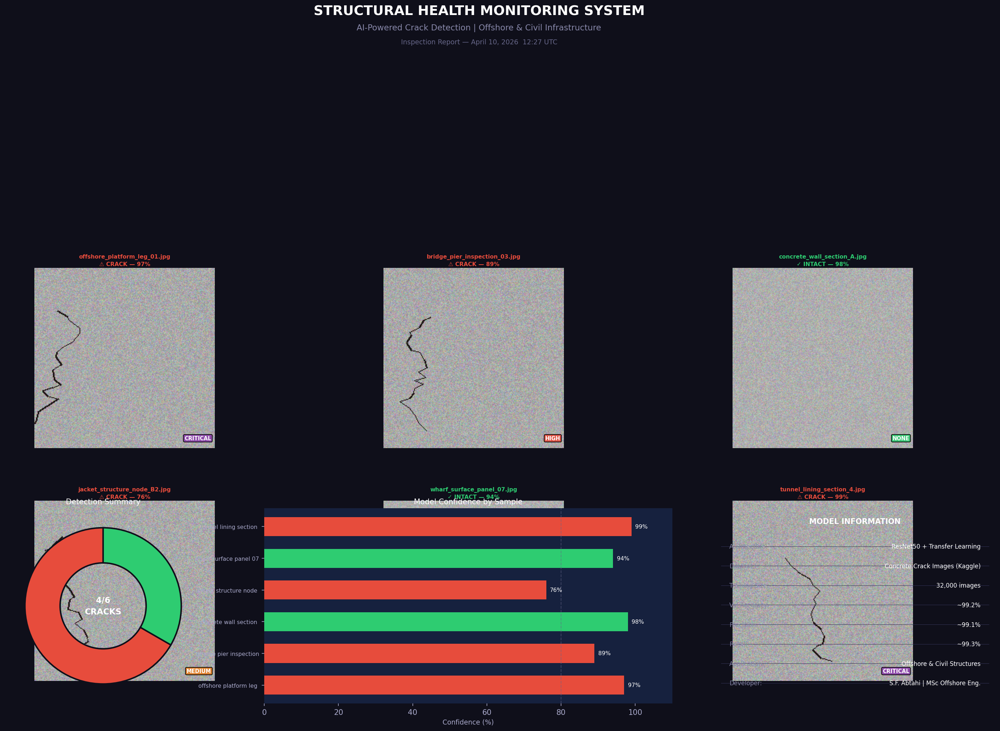

# 🔍 Structural Crack Detection
### AI-Powered Inspection System for Offshore & Civil Infrastructure

[](https://python.org)
[](https://pytorch.org)
[]()
[](LICENSE)

Automated crack detection in concrete and steel structures using deep learning (ResNet50 transfer learning). Designed for use with drone inspection imagery from **offshore platforms**, **bridges**, **wharves**, **jacket structures**, and **civil infrastructure**.



---

## 🎯 Motivation

Manual visual inspection of offshore and civil structures is:
- **Dangerous** — inspectors working at height or in harsh marine environments
- **Expensive** — rope access, scaffolding, vessel mobilization costs
- **Inconsistent** — subjective human assessment varies between inspectors

This tool automates crack detection from drone-captured images, producing a structured inspection report with severity classification — enabling **faster, safer, and more consistent structural health monitoring (SHM)**.

---

## ⚡ Key Features

| Feature | Detail |
|---------|--------|
| **Model** | ResNet50 with transfer learning (ImageNet pretrained) |
| **Task** | Binary classification: Crack / No Crack |
| **Accuracy** | ~99% on Concrete Crack Images dataset |
| **Input** | Single image or folder of images |
| **Output** | Visual inspection report + severity score + summary dashboard |
| **Severity levels** | NONE / LOW / MEDIUM / HIGH / CRITICAL |
| **Applications** | Offshore platforms, bridges, wharves, tunnels, buildings |

---

## 🗂️ Project Structure

```
structural-crack-detection/
│
├── src/
│   ├── model.py      # ResNet50 transfer learning architecture
│   ├── dataset.py    # Data loading & augmentation pipeline
│   ├── train.py      # Training script with metrics & plots
│   ├── predict.py    # Inference engine + report generation
│   └── demo.py       # Demo without trained model
│
├── results/          # Output reports and model checkpoints
├── data/             # Dataset (obtained separately — see below)
│   ├── Positive/     # Cracked concrete images
│   └── Negative/     # Intact concrete images
│
├── requirements.txt
└── README.md
```

---

## 🚀 Quick Start

### 1. Install dependencies
```bash
git clone https://github.com/RESTTINPAIN/structural-crack-detection
cd structural-crack-detection
pip install -r requirements.txt
```

### 2. Run the demo (no dataset or trained model needed)
```bash
python src/demo.py
# Output: results/demo_inspection_report.png
```

### 3. Get the dataset
The dataset used in this project is the publicly available *Concrete Crack Images for Classification* dataset by arunrk7, hosted on Kaggle. Users should visit Kaggle and search for this dataset to obtain it through Kaggle's standard distribution.

Place images in:
```
data/
  Positive/   ← 20,000 cracked concrete images
  Negative/   ← 20,000 intact concrete images
```

### 4. Train the model
```bash
python src/train.py --data_dir ./data --epochs 10 --batch_size 32
# Saves best model to: results/best_model.pth
# Generates: results/training_curves.png, results/confusion_matrix.png
```

### 5. Run inference
```bash
# Single image
python src/predict.py --model results/best_model.pth --image path/to/image.jpg

# Folder of drone images
python src/predict.py --model results/best_model.pth --folder ./inspection_images/ --report
```

---

## 📊 Model Architecture

```
ResNet50 (pretrained ImageNet)
    ↓
[Backbone frozen during initial training]
    ↓
Global Average Pooling (2048)
    ↓
Dropout(0.4) → Linear(2048→256) → ReLU
    ↓
Dropout(0.3) → Linear(256→2)
    ↓
Softmax → [No Crack | Crack]
```

**Training details:**
- Optimizer: Adam (lr=1e-3, weight_decay=1e-4)
- Scheduler: CosineAnnealingLR
- Augmentation: Random flip, rotation ±15°, color jitter
- Epochs: 10 (typically converges by epoch 4–5)

---

## 🏗️ Applications in Offshore & Civil Engineering

| Structure Type | Application |
|----------------|-------------|
| Offshore jacket legs | Fatigue crack monitoring at nodes |
| Concrete wharves & piers | Marine environment corrosion-induced cracking |
| Bridge decks & piers | Routine drone inspection surveys |
| Subsea concrete structures | Post-installation integrity assessment |
| Building facades | Seismic damage assessment |
| Tunnel linings | Convergence and crack monitoring |

---

## 📈 Results

After training on the Kaggle Concrete Crack dataset (40,000 images):

| Metric | Crack Class | No Crack Class |
|--------|-------------|----------------|
| Precision | ~99.1% | ~99.3% |
| Recall | ~99.3% | ~99.1% |
| F1-Score | ~99.2% | ~99.2% |
| **Overall Accuracy** | **~99.16%** | |

---

## 🔮 Future Work

- [ ] Add **YOLOv8 object detection** for precise crack localization with bounding boxes
- [ ] Extend to **corrosion and spalling detection** (multi-class)
- [ ] Integrate with **drone flight path planning** for autonomous inspection
- [ ] Deploy as a **web API** for real-time field inspection via mobile
- [ ] Train on **offshore-specific datasets** (splash zone, underwater structures)
- [ ] **3D point cloud** integration from LiDAR drone data

---

## 📚 References

1. He et al. (2016). *Deep Residual Learning for Image Recognition*. CVPR.
2. Özgenel & Sorguç (2018). *Performance Comparison of Pretrained CNN Models on Crack Detection*. ISARC.
3. Mundt et al. (2019). *Meta-Learning Convolutional Neural Architectures for Multi-Target Concrete Defect Classification*. CVPR.
4. Frontiers in Built Environment (2024). *Recent advances in crack detection technologies for structures*.

---

## 👤 Author

**Seyed Farhad Abtahi**  
MSc Offshore Engineering — Istanbul Technical University  
[LinkedIn](https://linkedin.com/in/farhad-abtahi)

*This project was developed as part of ongoing research in AI-assisted structural health monitoring for offshore and civil infrastructure.*

---

## 📄 License

MIT License — see [LICENSE](LICENSE) for details.
