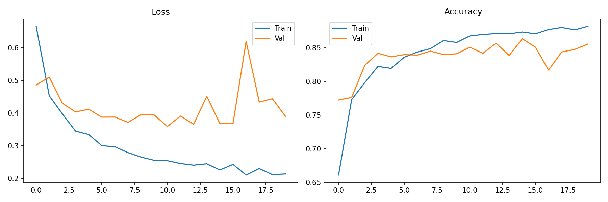
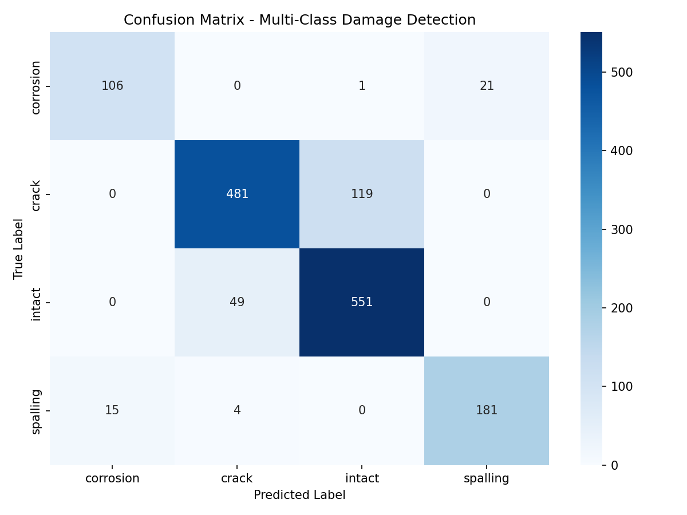
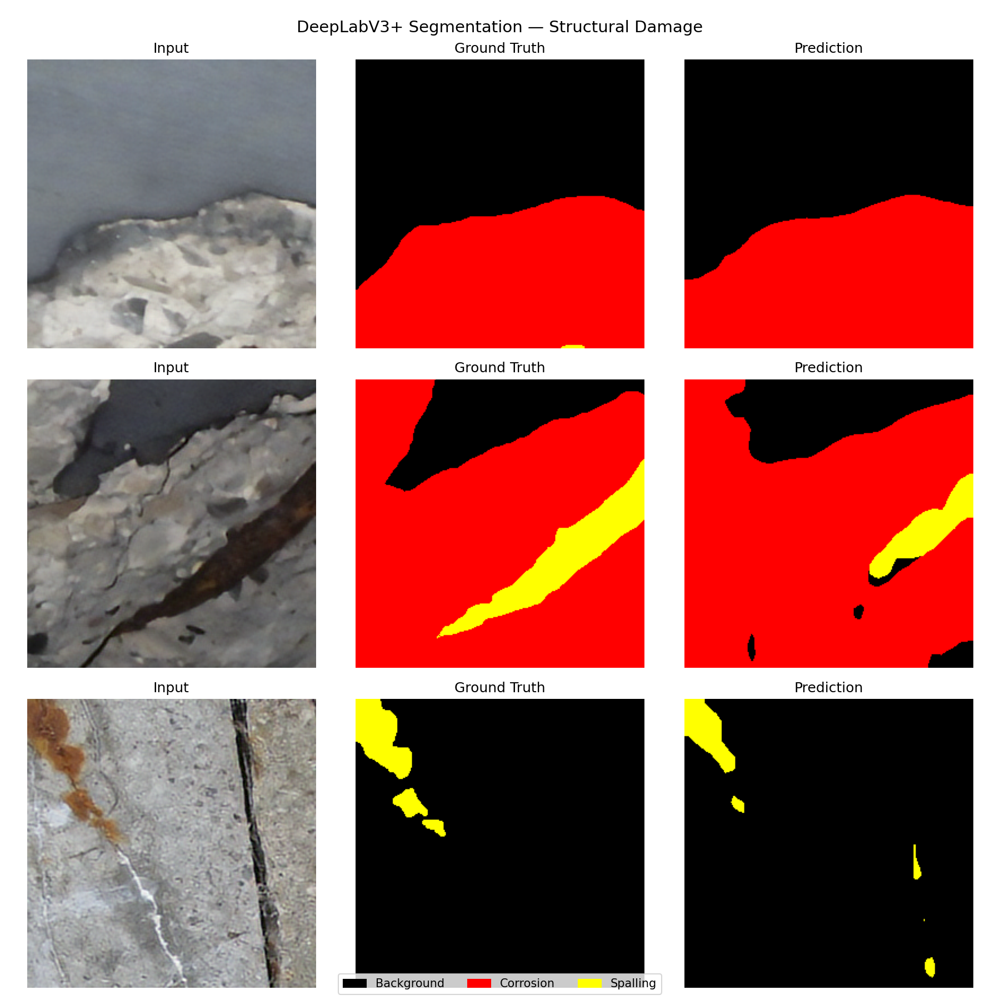
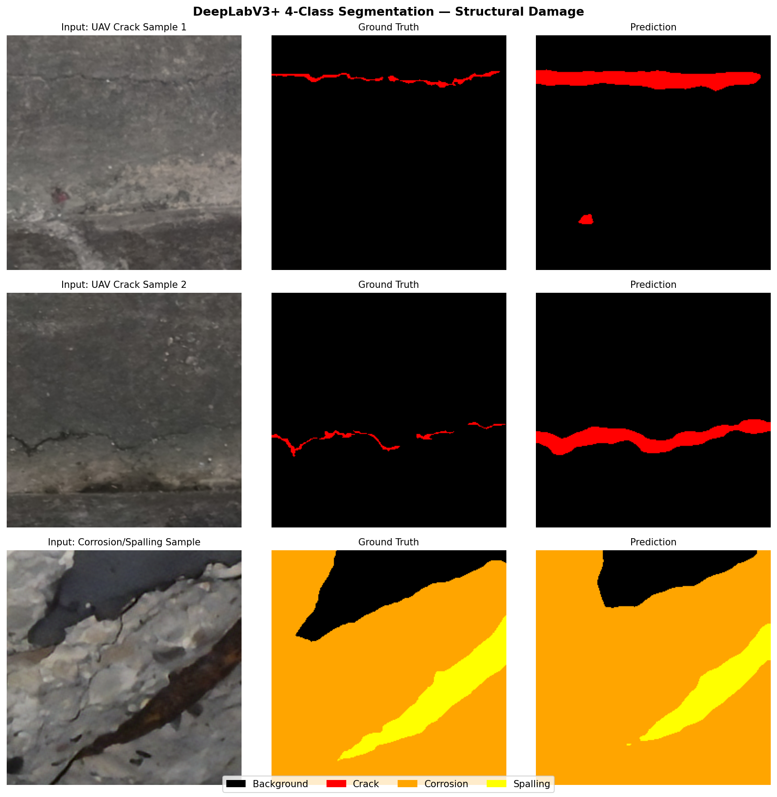
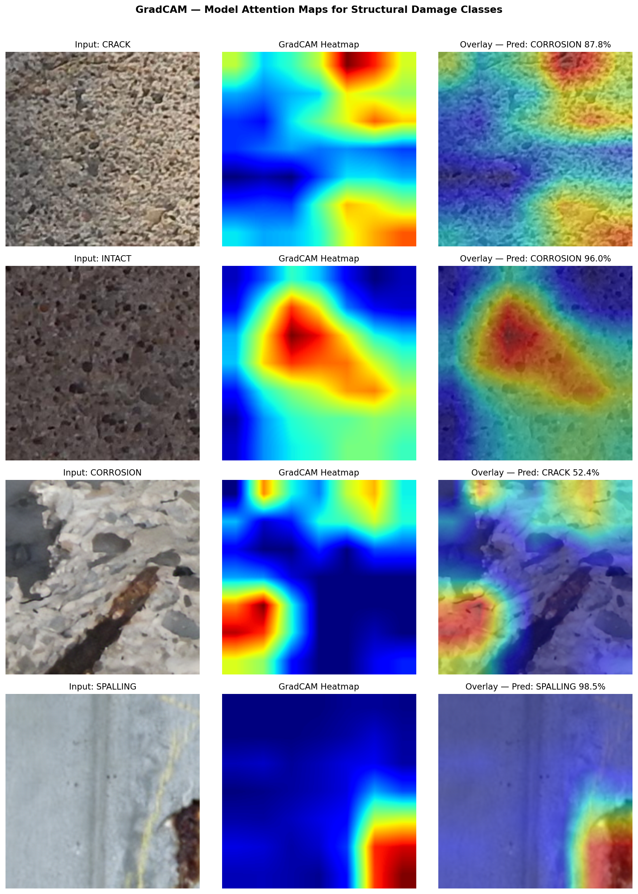
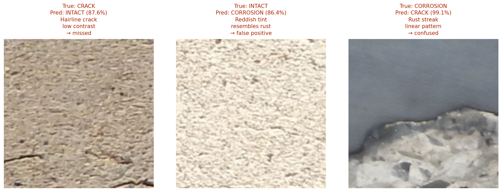
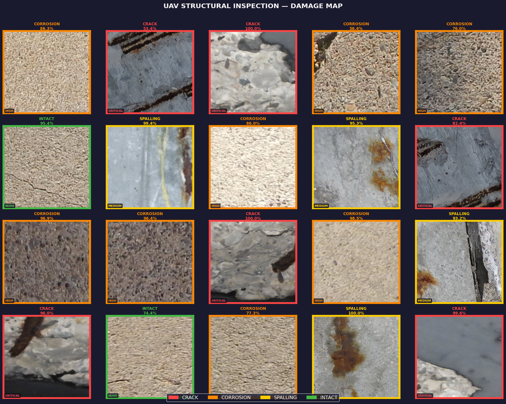

# Structural Crack Detection

**Automated Multi-Class Structural Damage Detection and Segmentation for UAV-Based Infrastructure Inspection Using Deep Learning**

Reference implementation for the paper submitted to *Structures* (Elsevier, 2026).

A three-stage deep learning pipeline for automated structural damage detection, segmentation, and UAV inspection simulation. Targets bridges, offshore platforms, and other civil infrastructure.


---

## Overview

| Stage | Task | Model | Key Result |
|-------|------|-------|------------|
| 1 | Four-class damage classification (crack, corrosion, spalling, intact) | ResNet50 with differential learning rates | 85.69% accuracy |
| 2 | Pixel-level semantic segmentation | DeepLabV3+ with ResNet50 backbone | mIoU 0.789 (3-class), 0.645 (4-class) |
| 3 | UAV grid inspection simulation | Boustrophedon traversal over 4×5 grid | 16/20 zones detected (80%) |

All stages were trained and benchmarked on CPU hardware (Intel processor, no GPU). Measured Stage 1 inference rate: 61 FPS.

---

## Repository Structure

```
structural-crack-detection/
├── src/                      # Core model and pipeline code
├── results/
│   └── plots/                # Publication-ready figures
├── analyze_crack_masks.py    # 4-class segmentation analysis
├── analyze_labels.py         # Stage 2 segmentation evaluation
├── augment_corrosion.py      # Targeted augmentation for corrosion class
├── augment_spalling.py       # Targeted augmentation for spalling class
├── drone_simulation.py       # Stage 3 UAV grid inspection simulation
├── extract_classes.py        # Class extraction from RGB masks
├── failure_analysis.py       # Qualitative failure case analysis
├── fix_gradcam.py            # Grad-CAM visualization
├── gradcam.py                # Grad-CAM core implementation
├── inference_time.py         # CPU inference benchmarking (Stage 1)
├── per_class_iou.py          # Per-class IoU reporting
└── README.md
```

---

## Requirements

- Python 3.9+
- PyTorch 2.1.0
- torchvision
- numpy, matplotlib, scikit-learn, Pillow, opencv-python

Install with:

```bash
pip install -r requirements.txt
```

---

## Datasets

Three publicly available datasets are used across the three stages:

1. **SDNET2018** — 56,092 concrete surface images (bridge decks, walls, pavements). Binary crack annotations. Used for Stage 1 (crack and intact classes). Available from the original dataset authors.

2. **Corrosion and Spalling Segmentation Dataset (Raidathmane, Kaggle)** — 1,580 image–mask pairs with pixel-level RGB annotations. Used for Stage 1 (corrosion and spalling classes) and Stage 2 (3-class segmentation). https://www.kaggle.com/datasets/raidathmane/corrosion-and-spalling-concrete-defect-segmentation

3. **UAV-Based Crack Detection Dataset (Ziya07, Kaggle)** — 315 real UAV images of cracked concrete surfaces with binary segmentation masks. Used for Stage 2 (4-class segmentation). https://www.kaggle.com/datasets/ziya07/uav-based-crack-detection-dataset

Datasets are not bundled with this repository. Follow the source links to download.

---

## Pretrained Model Weights

Pretrained weights for all three models are available as assets in the **v1.0 Release**:

**https://github.com/far-reach/structural-crack-detection/releases/tag/v1.0**

| File | Stage | Description | Size |
|------|-------|-------------|------|
| `best_resnet50_multiclass.pth` | Stage 1 | ResNet50 four-class classifier | 92 MB |
| `best_deeplabv3_segmentation.pth` | Stage 2 | DeepLabV3+ three-class segmentation | 161 MB |
| `best_deeplabv3_4class.pth` | Stage 2 | DeepLabV3+ four-class segmentation (includes UAV crack data) | 161 MB |

Place downloaded weights in a local `models/` directory (create if absent) before running inference scripts.

---

## Results

### Stage 1 — Four-class classification
- Overall accuracy: **85.69%** on original held-out validation set (1,600 samples)
- Per-class F1: crack 0.839, intact 0.862, corrosion 0.860, spalling 0.886
- Differential learning rate strategy improved accuracy by **8.25%** over frozen-backbone baseline





### Stage 2 — Semantic segmentation
- 3-class (background / corrosion / spalling): **mIoU 0.789**, pixel accuracy 0.918
- 4-class (+ crack): **mIoU 0.645**, crack IoU 0.206 (reflecting 1.78% mean crack pixel density)





### Grad-CAM Interpretability

Grad-CAM visualizations confirm the classifier attends to visually relevant damage regions across all four classes.



### Failure Analysis

Three representative misclassification cases are included to identify targeted improvement directions (hairline cracks on textured surfaces, wet corrosion, and boundary spalling).



### Stage 3 — UAV grid inspection simulation
- **16 of 20** damaged zones detected (80%)
- Mean inference confidence: 88.4%
- Total CPU inference time for 20 frames: 0.33 s



### Computational performance (Stage 1, CPU)
- Mean inference time: **16.29 ms** per frame
- CPU throughput: **61.39 FPS**
- Exceeds typical UAV camera capture rate (25–30 FPS)

---

## Citation

If you use this code or the pretrained weights in your work, please cite the paper:

```
Abtahi, S.F. (2026). Automated Multi-Class Structural Damage Detection and
Segmentation for UAV-Based Infrastructure Inspection Using Deep Learning.
Structures. [Manuscript under review.]
```

Citation will be updated upon acceptance.

---

## License

MIT License — see [LICENSE](LICENSE) for details.

---

## Author

**Seyed Farhad Abtahi**
Independent Researcher, Istanbul, Türkiye
ORCID: [0009-0007-8865-2300](https://orcid.org/0009-0007-8865-2300)
Contact: farhadabtahi91@gmail.com
